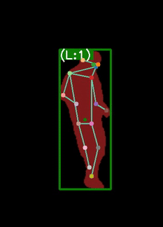
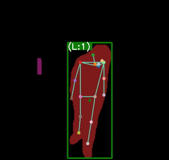
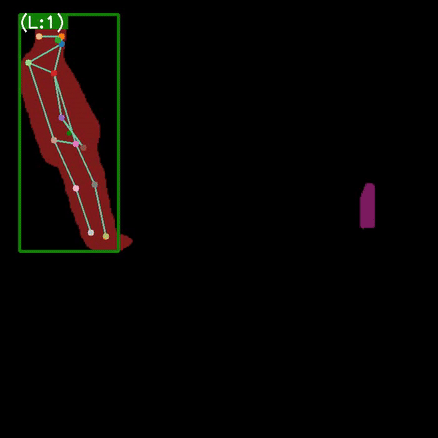

# From Offline to Periodic Adaptation for Pose-Based Shoplifting Detection in Real-world Retail Security
## Overview
This Github repository contains the official implementation and dataset details for the paper:
"From Offline to Periodic Adaptation for Pose-Based Shoplifting Detection in Real-world Retail Security" published in [IEEE Internet of Things Journal](https://www.researchgate.net/publication/400393842_From_Offline_to_Periodic_Adaptation_for_Pose-Based_Shoplifting_Detection_in_Real-world_Retail_Security).  
We present a privacy-preserving, pose-based framework for shoplifting detection designed for on-site IoT deployment. Our pipeline enables edge devices to adapt from streaming, unlabeled data through continual unsupervised learning, overcoming environmental drift and changing shopper behaviors.


## Key Features

- Periodic Adaptation Pipeline: A three-stage (Filtering, Collecting, Training) framework designed for periodic model updates on unlabeled streaming data.
- RetailS Dataset: A large-scale, multi-camera dataset featuring nearly 20M normal frames and both staged and authentic shoplifting incidents
- IoT-Optimized Metrics: Introduction of the $H_{PRS}$ Score (harmonic mean of Precision, Recall, and Specificity) to strictly control false alarms in retail environments
- Privacy-Preserving: Represents human activity through anonymized pose sequences (COCO17 format), removing raw pixel information.

## Periodic Adaption Pipeline
The framework is divided into three operational stages to mirror IoT deployment:
1- Filtering: Uses adaptive thresholds ($F1$ or $H_{PRS}$) to screen incoming streams.
2-Collection: Aggregates pseudo-labeled normal frames into buffered sets.
3-Training: Periodically fine-tunes the model (Half-day or Daily cycles) to capture local drift.

## Retails Dataset Description
### Features 
1- **Privacy-Preserving**
The dataset includes pose sequences derived from CCTV footage, with anonymized human identities and no raw pixel-level video data. This ensures full following of privacy regulations and safeguards individual privacy.

2- **Real-World Data**: PoseLift is developed through close collaboration with a local retail store, ensuring that it captures authentic shoplifting incidents alongside normal shopping behaviors in real-world retail environment.

3- **Pose-Based Annotations**: PoseLift provides bounding boxes, person IDs, and human pose annotations instead of raw videos to support privacy-preserving shoplifting detection.

4- **Camera Views**: The dataset utilizes videos from 6 indoor cameras (C1 to C6) positioned across various aisles and locations in a local retail store in the USA. 

5- **Diverse Shoplifting Behaviors**: The dataset includes a wide range of normal shopping behaviors alongside real shoplifting activities. The shoplifting behaviors demonstrated in these videos included actions such as placing items into pockets, placing them in bags, and hiding them under shirts, jackets, and pants. 
<table>
  <tr>
    <td style="text-align: center;">
      <br />
      Hiding an item in their pants
    </td>
    <td style="text-align: center;">
      <br />
      Hiding an item under their T-shirt
    </td>
    <td style="text-align: center;">
      <br />
      Placing an item in their pockets
    </td>
  </tr>
</table


### Data Processing

- **Pose Data Extraction**: Anonymized pose data is extracted from the original videos using state-of-the-art models, including YOLOv8 for object detection, ByteTrack for person tracking, and HRNet for human pose estimation.

- **Data Modifications**: To address occlusions caused by store shelves, specific areas of interest for each camera were defined. Missing poses were interpolated, and data smoothing was applied for continuity.

- **Annotations and Shoplifting Labels**:
1-Annotations (.pkl)
Each video in the RetailS dataset has a corresponding annotation file in pickle format. The files are named according to the camera and video ID (e.g., cam1_video101.pkl).
The data is structured as a nested dictionary where each frame maps to the detected individuals and their respective pose data. Each file offer detailed frame-by-frame annotations, including Person ID, and keypoints for each individual in the frame. The annotations are organized in a dictionary structure, with each key representing a specific frame number. For each frame, the annotation includes:
- **Person ID**: A unique identifier for each individual detected in the frame.

- **Keypoints**: Represented in the XYC format, where X and Y are the coordinates of key points, and C is the confidence score associated with the detection of each keypoint.

2-Anomaly Labels (.npy)
Anomaly labels are provided as binary NumPy arrays (.npy) for every frame in the video. The anomaly labels are provided in .npy format, with one label file for each video. The labeling follows the same naming pattern as the corresponding video file, ensuring easy mapping between the pickle file and its labels. So,each label file contains a NumPy array of binary values (0s and 1s), categorizing all frames into two groups: normal behavior or shoplifting. The length of the array corresponds to the total number of frames in the respective video. A value of 0 indicates a "normal" frame, where no shoplifting behavior is detected. A value of 1 indicates an "anomalous" frame, where shoplifting behavior is identified based on the observed actions within that frame.
0: Normal behavior (e.g., browsing, walking).
1: Shoplifting anomaly (e.g., pocket or bag concealment).


### Dataset Statistics

RetailS is significantly larger and more diverse than previous retail security datasets.

<sub> Table 1: 
| Subsets         | Normal Frames | Shoplifting Events| Shoplifting Frames | Camera Views |
|------------------|---------|-------|-----|-----|
| RetailS Train         |   19,971,589   | 0        | 0   | 6 |
|Real-world Test          |   2,432    |  1,933       | 53    | 6 | 
| Staged Test          |   20,578    |  20,335       | 898  | 6 |


## Benchmarking Results
Model Performance (Offline vs. Periodic)
Our periodic adaptation framework outperforms offline baselines in 91.6% of evaluations.

<sub> Table 2:  Average training time (in minutes) per update for continual learning with half-day and one-day data batches across three state-of-the-art pose-based models.

|    Model    | Half-day data | One-day data| 
|------------------|---------|-------|
| STG-NF         |   3.5  |7.3       |
|TSGAD         |   26.8    |  65       |  
|SPARTA         |   2.05    |  3.2       |  


## Dataset Download Instructions
To download the dataset and instructions for training anomaly detection models, please use the following link:

[Retails](https://).


## Citation
If you find our work useful, please consider citing: 

```bibetex
@ARTICLE{11370135,
  author={Yao, Shanle and Rashvand, Narges and Pazho, Armin Danesh and Tabkhi, Hamed},
  journal={IEEE Internet of Things Journal}, 
  title={From Offline to Periodic Adaptation for Pose-Based Shoplifting Detection in Real-world Retail Security}, 
  year={2026},
  volume={},
  number={},
  pages={1-1},
  keywords={Training;Filtering;Cameras;Internet of Things;Anomaly detection;Adaptation models;Pipelines;Image edge detection;Real-time systems;Privacy;Shoplifting;artificial intelligence;IoT;computer vision;application;continual learning;dataset;real-world;edge;anomaly},
  doi={10.1109/JIOT.2026.3660205}}

```


## Contact
If you have any questions or need assistance, please contact the authors at nrashvan@charlotte.edu, and syao@uncc.edu
.


